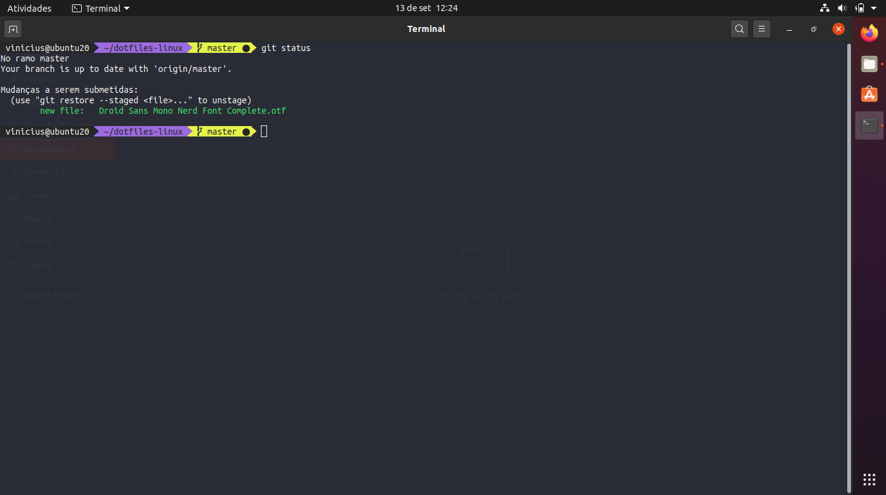
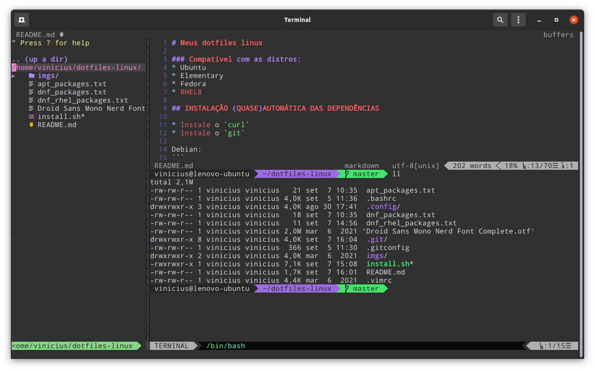

# Personal Linux dotfiles

## TODO

* Criar bashscript para automatizar a instalação das dependencias

## INSTALAÇÃO MANUAL DAS DEPENDÊNCIAS

* Clonar este repositório
* Instalar o GIT
* Instalar o VIM
* Instalar Oh-My-Bash `sh -c "$(curl -fsSL https://raw.github.com/ohmybash/oh-my-bash/master/tools/install.sh)"`
* Instalar [Dracula theme for gnome terminal](https://draculatheme.com/gnome-terminal/)
  * Instalar `dconf-cli` no Fedora: `sudo dnf install dconf*`
* Instalar [Dracula theme for VIM](https://draculatheme.com/vim/)
* Instalar Font for powerline:
 ```
 git clone https://github.com/powerline/fonts.git fonts
 cd fonts
 install.sh
 ```
* Instalar a Font `Droid Sans Mono Nerd`
* Copiar os arquivos de configuração do VIM Vundle `git clone https://github.com/VundleVim/Vundle.vim.git ~/.vim/bundle/Vundle.vim`
* Instalar NodeJS, a instalação deverá ser feita como *root*: com o comando `sudo su -` depois `curl -sL install-node.now.sh/lts | bash`
* Instalar [Yarn](https://classic.yarnpkg.com/en/docs/install/)
* Copiar `.bashrc` e `.vimrc` para a pasta $HOME `~/` renomeando os arquivos originais ex.: `.bashrc.old`
* No VIM executar o comando `:PluginInstall`

# SCREENSHOTS






